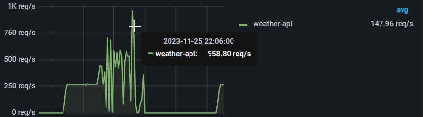
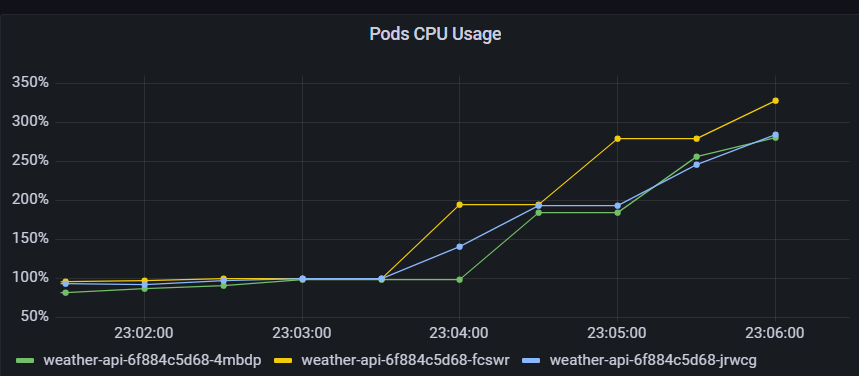

Версия приложения : f0135e1
## Профили нагрузки

### Stability
- Проверяет  стабильность работы сервиса под нагрузкой.

### MaxPerformance
- Необходимо для нахождения проблемных мест в API.

Оба профиля нагрузки реализованы при помощи инструмента Gatling и настраиваются в файле `resources/simulation.conf`.

---

# Соглашение об уровне обслуживания (SLA) и Цели уровня обслуживания (SLO) для API 
## SLA (Соглашение об уровне обслуживания)

- Среднее время ответа на конечную точку `/cities` составит 2.5 секунду.
- Среднее время ответа на конечную точку `/cities/{id}` составит 1 секунду.
- Среднее время ответа на конечную точку `/Forecast` составит 2.5 секунду.
- Среднее время ответа на конечную точку `/WeatherForecast` составит 4 секунды.

## SLO (Цели уровня обслуживания)

### Время ответа
- 95% запросов к `/cities`, `/cities/{id}` и `/Forecast` должны обрабатываться в течение 1 секунды.
- 95% запросов к `/WeatherForecast` должны обрабатываться в течение 3 секунд.
- Не более 5% запросов должны превышать установленные времена ответа.

## Емкость и производительность
- Приложение спроектировано для обработки нагрузки до 400 запросов в секунду (rps).
- При нормальной операционной нагрузке использование процессора должно оставаться ниже 92%.

---

# Результаты тестиррования

 Входе тестирования было выявлены следующие проблемы:
- Максимальное количество запросов которое может выдержать приложение составляет 400 rps/s, при такой нагрузке приложение способно отвечать  запросов корректно,при более высокой нагрузкиm начинатеся рестарт подов, а также диградация времеи ответа на запрос :
 

- Быстрая деградация метода `/WeatherForecast`, который тянет за собой все остальное приложение, это связано с тем, что в приложении выполняется неоптимальный запрос к БД, который вызывает по проблемы n+1, когда 1 запрос к сущности  плодит за собой множество подзапросов к БД

- Опираясь на предыдущий пункт появляется еще одна проблема связанная с пдключениями к API, в результате чего pod не спровляются с нугрузкой, так как не могут закрыть сессию, что приводит к их рестарту и подению приложения

Отчет выполнения Gatling:

